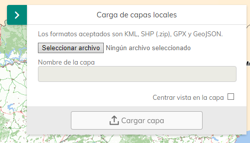

# M.plugin.AddLayers

Plugin que permite añadir capas desde una url local en diferentes formatos.

Soporta los formatos KML, SHP (.zip), GPX y GeoJSON.



## Dependencias

- addlayers.ol.min.js
- addlayers.min.css

## Ejemplos de uso

### Ejemplo 
```javascript
   const map = M.map({
     container: 'map'
   });

   // crear el plugin
   const mp = new M.plugin.AddLayers();

   // añadirlo al mapa
   map.addPlugin(mp);
});


